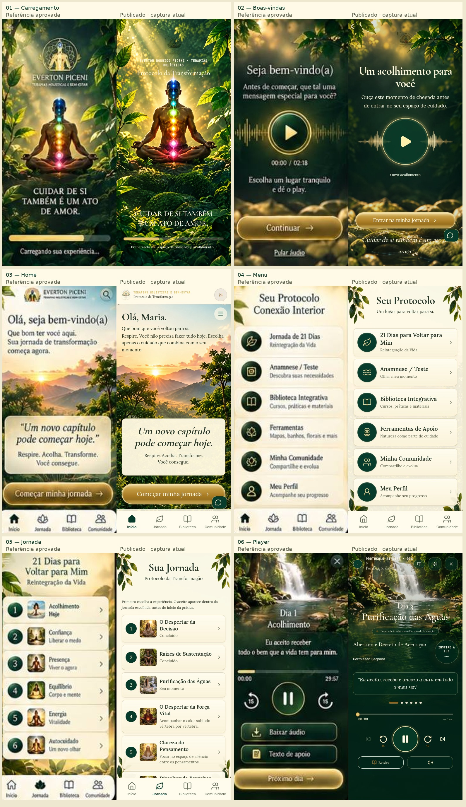
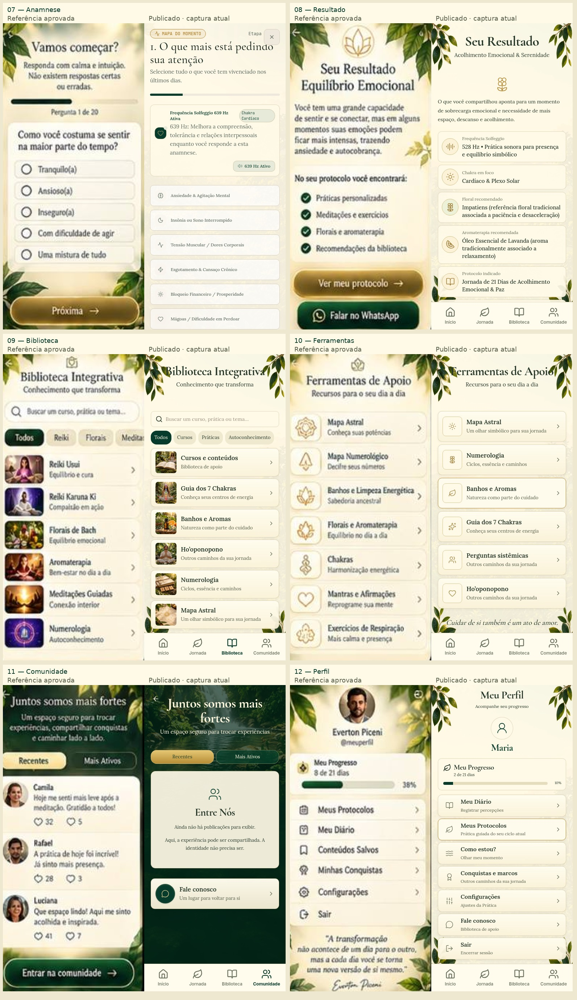

# Auditoria completa — Estilo 1: Natural Sereno

Data: 04/10/2026. Versão examinada: produção, commit `463a3e9ec350ed2f15cc4f8fbdc8c68485b026c9`, deployment `dpl_ByMoxRWsUZWW5EzyWnqD7qh3iycQ`, estado READY. Endereço: https://protocolo-de-cura-integrativa.vercel.app/.

**Parecer: o Estilo 1 ainda não deve ser considerado concluído.** A identidade de natureza, marfim, verde e dourado já aparece nas telas principais, e os fluxos exercitados funcionam. A reprodução integral da prancha não está aprovada: existem diferenças estruturais de composição, telas internas com outra estética e problemas confirmados de interação/acessibilidade. Não avançar para o Estilo 2.

A etapa inicial de diagnóstico não alterou o aplicativo ou dados remotos. Após o usuário apontar os problemas de animação, roteiro, proporção web e excesso de informação, foram implementadas as correções descritas ao final. O diagnóstico abaixo registra a versão publicada antes dessas correções.

## Método e limites

- Referência: painel Natural Sereno de 12 telas fornecido pelo usuário, copiado em `reference.jpg`. As comparações removem a moldura do aparelho e normalizam o conteúdo para aproximadamente 390 × 844; não são medições de equivalência pixel a pixel.
- Capturas novas do site publicado nesta execução. Os nomes, respostas e progresso da área autenticada são dados sintéticos interceptados no navegador. O HTML, JavaScript, CSS e imagens são os da produção. Isso permite auditar a interface publicada sem acessar ou alterar contas reais.
- Cadastro/login públicos, disponibilidade da API, rejeição de cadastro inválido e carregamento/decodificação da amostra masculina também foram verificados sem simular as respostas do servidor.
- Cadastro válido, sincronização, sessão, login e duplicidade foram exercitados novamente com o servidor real em banco local isolado. Não comprovam gravação de uma conta válida no banco remoto.
- Foram executadas 18 verificações do fluxo com Chromium; cinco testes unitários; lint TypeScript; build; axe-core 4.13.0 em 23 estados e seis telas/estados adicionais; verificações manuais de teclado, foco, sobreposição e troca de temas.
- Larguras examinadas: 320, 390, 768 e 1440 px. Cadastro expandido: 320, 390 e 713 px. Altura reduzida: 390 × 422. Não houve teste em Safari/iPhone físico, TalkBack, VoiceOver ou NVDA. O relatório não certifica conformidade WCAG integral.
- A narração contínua integral, duração real de uma sessão, pausa/retomada com áudio neural e conclusão persistida no banco remoto não foram validadas. O áudio foi controlado nas verificações das etapas; a amostra masculina pública foi carregada/decodificada de verdade.
- Não foram efetuadas compras, envio de mensagens, recuperação de senha por e-mail ou publicações na comunidade.

Capturas de login com cabeçalho não pintado foram descartadas após conferência do DOM e nova captura em navegador limpo. A evidência aceita de login é `screens/login.png`; esse artefato de captura não foi classificado como defeito do produto.

## Auditoria das 12 telas

Os estados abaixo distinguem funcionamento observado e fidelidade visual. “Parcial” não significa aprovação da tela como cópia do modelo.

| Etapa | Tela | Funcionamento observado | Fidelidade e saúde da etapa |
|---|---|---|---|
| 1 | Splash / carregamento | Carregamento da autenticação capturado com atraso controlado. | **Parcial.** Folhagem, luz e figura com chakras aproximam a referência. Logo oficial escurece e perde legibilidade; escala/posição da assinatura e composição diferem. |
| 2 | Boas-vindas | Ouvir/pausar e entrar na jornada respondem; entrada é mantida na sessão. Áudio integral não foi certificado. | **Parcial.** Fundo, onda e botão dourado estão presentes. Círculo de áudio é desproporcional à referência, título ocupa mais espaço e logo quase desaparece no fundo escuro. |
| 3 | Home | Menu, início da jornada e barra inferior respondem. | **Parcial com problema de interação.** Paisagem e cartão central são próximos. Cabeçalho, hierarquia dos textos e proporções diferem; botão de contato sobrepõe parte do CTA principal. |
| 4 | Menu | Seis destinos acessíveis; última linha cabe acima da barra em 390 × 844. | **Parcial, entre as telas mais próximas.** Verde/marfim/dourado coerentes. Ícones, bordas, densidade e título não reproduzem exatamente a prancha. |
| 5 | Jornada / lista de dias | 21 miniaturas distintas carregam; dia selecionado é levado ao player; estado de conclusão vem do progresso. | **Parcial.** Introdução e linhas maiores deixam cinco dias completos visíveis em 390 × 844, contra seis na referência. A aba mostra o Protocolo da Transformação; o primeiro acesso do Menu abre outra jornada, a Reintegração congelada. |
| 6 | Player | Aceite → check-in → player; play/pausa, avanço/retorno e roteiro exercitados sem erro de execução. | **Divergência alta.** Cachoeira e paleta estão presentes. Etapas, respiração, mantra, cabeçalho e controles ocupam outra distribuição. Pontos de etapa são alvos de toque muito pequenos; preferência masculina não governa a voz fixa do player. |
| 7 | Anamnese / teste | Quatro etapas existentes avançam e retornam. | **Divergência alta e falhas de acessibilidade.** Apresentação extensa em quatro etapas difere da pergunta compacta da referência. Próxima etapa herda rolagem; foco sai do modal; slider sem nome acessível. Perguntas/regras aprovadas devem permanecer. |
| 8 | Resultado | Usa o motor existente de recomendações e dados da anamnese. | **Parcial.** Mostra frequência, chakra, floral, aroma, protocolo e duração. Cards, ícones e densidade diferem; duração e ações ficam abaixo da primeira área visível, ao contrário da composição da referência. |
| 9 | Biblioteca | Busca, ausência de resultados e acesso às categorias funcionam. Seis destinos e imagens cabem acima da barra em 390 × 844. | **Parcial, entre as telas mais próximas.** Miniaturas e linhas existem. Cabeçalho/folhagem e categorias diferem; ao abrir Cursos, a identidade se rompe com roxo e cartão escuro. |
| 10 | Ferramentas | Abertura de Mapa Astral confirmada; demais ações usam callbacks existentes. Não equivale a teste funcional integral de todas as ferramentas. | **Parcial.** Lista clara, bordas e ícones dourados coerentes. Símbolos/acabamento diferem; o destino Mapa Astral ainda usa outra estética. |
| 11 | Comunidade | Abas e contato respondem; estado vazio acessível é mostrado. | **Exceção autorizada, apresentação parcial.** Sem publicações fictícias ou novas APIs, conforme decisão do usuário. Fundo escuro coerente, mas composição, folhagem e altura do cartão diferem. Abas não têm conteúdo real para ordenar. |
| 12 | Perfil | Progresso reflete os dados fornecidos; contato, configurações e saída ficam acessíveis. | **Parcial.** Perfil genérico sem foto é legítimo quando a conta não possui avatar. Cards separados, cabeçalho, densidade e distribuição não correspondem ao painel; assinatura final está abaixo da área visível. |

Os valores, nomes de dias, perguntas, categorias e recomendações ilustrados na prancha não devem substituir conteúdo aprovado no código. Por exemplo, não inserir os cursos demonstrativos da imagem onde não existe um destino funcional aprovado; não trocar respostas do motor de recomendação para imitar o exemplo; não usar a foto de Everton como avatar de todos. A correção deve reproduzir a apresentação mantendo dados e comportamentos existentes.

## Cadastro, login, aceite e telas internas

**Cadastro:** marfim, campos claros, folhagem e logo oficial de 76 px confirmados em produção. O painel expandido mantém a paleta mesmo quando outro ID de tema está no documento. Horário/cidade e cartões não apresentam overflow horizontal nos tamanhos medidos. A opção masculina não se identifica como voz de Everton. A amostra pública decodifica aproximadamente 5,71 s e funciona como arquivo disponível antes do login. Permanecem problemas de teclado na seleção das opções e textos muito pequenos nos rodapés dos cartões. A prancha de 12 telas não contém uma tela específica de cadastro; sua identidade pode ser auditada, mas não existe base para declarar igualdade exata de posições/campos nessa tela.

**Login:** campos claros, logo legível e aba funcional. O link “Esqueci minha senha” abre somente uma mensagem de recurso futuro; recuperação por SMS/e-mail não está implementada. É uma limitação existente, observada nesta auditoria, não uma regressão atribuída ao tema.

**Erro de cadastro:** a API pública rejeitou `{}` com HTTP 400 e JSON “Dados de registro inválidos.”; não foi reproduzido o antigo erro de inicialização. Quando HTTP 500 não JSON foi simulado no navegador, a interface exibiu indisponibilidade e “Tentar novamente”. O sucesso de criação, sincronização e login foi comprovado somente em banco local isolado, não em uma nova conta remota.

**Portal de aceite:** existe antes do check-in e mantém o texto/callback aprovados. Marfim, borda e CTA dourado coerentes. A prancha não oferece referência independente para esse portal. A paleta é melhor alinhada que a das telas auxiliares; não foi certificado comportamento com leitor de tela ou gestão completa de foco.

**Configurações, Cursos e Mapa Astral:** mostram partes claras, mas mantêm botões roxos, destaques azuis/laranja, cartões escuros ou gradientes fora do tema. O quadro principal da Biblioteca estar claro não basta para considerar o percurso completo Natural Sereno.

**Acesso gratuito:** a tentativa de abrir dia 8 exibiu a proteção existente de plano PRO. Nenhum pagamento foi acionado. A mensagem diz que o ciclo inicial foi concluído mesmo com progresso sintético 0/21; é uma inconsistência preexistente de mensagem/estado. Alteração de regra comercial está fora desta auditoria e da implementação visual autorizada.

Evidências adicionais: [cadastro](screens/registration.png), [cadastro completo](screens/registration-full.png), [opções](screens/registration-options.png), [login](screens/login.png), [recuperação](screens/password-recovery.png), [erro simulado](screens/registration-error.png), [aceite](screens/portal.png), [configurações](screens/settings-top.png), [Cursos](screens/library-destination.png), [Mapa Astral](screens/tool-destination.png) e [dia 8 gratuito](screens/free-day8-gate.png).

## Achados confirmados e prioridades

P1: corrigir antes de encerrar o Estilo 1. P2: acabamento ou lacuna existente a tratar após os P1. A classificação considera o impacto no objetivo do usuário; não é uma classificação de segurança.

### A01 — P1 — Reprodução visual ainda incompleta

Home/Menu apresentam evolução, mas Player, Anamnese e Resultado mantêm estrutura visual distante da referência. Tipografia, ornamentos, relevo e escala das imagens são aproximações. **Correção:** transpor proporções e acabamento por tela, manter funções extras existentes e o conteúdo aprovado; não reduzir funcionalidades para encaixar no exemplo. Evidência: as 12 comparações.

### A02 — P1 — Contato flutuante sobrepõe o CTA da Home

Em 390 × 844, CTA ocupa x=18–372 / y=676–746; contato ocupa x=326–378 / y=718–762. Há interseção real de 46 × 28 px, não apenas impressão visual. **Correção:** reservar espaço ou reposicionar contato sem cobrir o CTA nem a barra. Evidência: `extras.json`, Home e `compare-home.jpg`. Origem: `src/App.tsx:2406` e CSS do botão flutuante.

### A03 — P1 — Voice preference não controla o player principal

Cadastro persiste `voiceType: masculina`; acolhimento/resultado solicitam o alias masculino. Entretanto, `MeditationSession.tsx:158` passa `OFFICIAL_PROTOCOL_VOICE_ID`, definido como Marianne em `src/lib/audio.ts:1581`, sem usar essa preferência. **Correção:** explicitar e alinhar a regra da preferência no player principal conforme a autorização de voz; manter a voz da Reintegração congelada. Evidência de implementação, não de audição de uma sessão neural nesta execução. Não prometer que toda a experiência já está masculina.

### A04 — P1 — Seleção de voz não acessível por teclado

Os dois cartões são DIVs com onClick, sem role e com tabIndex -1. Os botões “Ouvir Amostra” são focáveis, mas não selecionam o cartão. **Correção:** controles de seleção com semântica e teclado próprios, mantendo a aparência. Evidência: `extras.json`; `src/components/ProfileSetup.tsx:592`.

### A05 — P1 — Zoom mobile bloqueado

`maximum-scale=1.0, user-scalable=no` na meta viewport. axe aponta o problema em todas as telas testadas. **Correção:** permitir ampliação e validar reflow, sem alterar lógica. WCAG 1.4.4. Evidência: `index.html:5` e `accessibility.json`.

### A06 — P1 — Contraste insuficiente

Cabeçalho institucional em dourado de 9 px sobre marfim: **1,58:1**, abaixo de 4,5:1. Texto auxiliar flutuante medido: **3,25:1**. Etapa 2 da anamnese, Cursos e Configurações também têm ocorrências. **Correção:** ajustar as cores dentro da paleta oficial e testar em cada fundo, especialmente elementos pequenos. WCAG 1.4.3. Evidência: `accessibility.json` e `accessibility-extras.json`. O risco do logo em fundos escuros requer avaliação visual adicional; não foi usado como cálculo de contraste de texto.

### A07 — P1 — Etapas do player têm alvos de toque minúsculos

Cinco pontos possuem área de 8 × 6 px e espaçamento insuficiente; o ponto ativo mede 32 × 6 px. O botão principal de play é grande, mas esses seletores não. **Correção:** aumentar a área clicável invisível para ao menos 24 × 24 px, preferindo 44 × 44 quando possível, mantendo o desenho do ponto. WCAG 2.5.8. Evidência: `accessibility.json`, estado player.

### A08 — P1 — Anamnese não retém nem direciona foco

Ao abrir, foco permanece fora do modal. Shift+Tab a partir do fechar leva a um botão da tela por trás. Escape não fecha. **Correção:** entrada/retorno de foco e contenção de teclado, com fechamento coerente quando permitido. O papel dialog e aria-modal já existem e devem permanecer. WCAG 2.1.1 / 2.4.3. Evidência: `extras.json`, testes manuais.

### A09 — P1 — Avançar na anamnese conserva rolagem

Ao ir para a etapa 2, contêiner manteve scrollTop 327; título apareceu em y=-281, fora da tela. As capturas das etapas seguintes mostram início cortado porque representam o estado real após avançar. **Correção:** reposicionar a apresentação/foco na nova etapa sem perder as respostas. Evidência: `extras.json`, `anamnesis-step2.png`, `anamnesis-step3.png` e `anamnesis-step4.png`.

### A10 — P1 — Campos sem nome acessível

Slider de estresse sem label associada. Nas Configurações, dois inputs, dois selects e o botão de fechar não possuem nome acessível; há também regiões roláveis não focáveis. **Correção:** associar os textos existentes aos controles e dar nome ao fechar/regiões. WCAG 1.3.1 / 4.1.2. Evidência: `accessibility-extras.json`; o axe classifica label/button-name/select-name como critical.

### A11 — P1 — Tema termina nas telas principais

Cursos e Mapa Astral conservam roxo/escuro; Configurações mantém cartão de status com aspecto de dashboard; cabeçalho desktop exibe Arcanjo azul e Sair rosa. **Correção:** variantes visuais restritas ao Natural Sereno para destinos e estados acessíveis, preservando callbacks, permissões e os outros temas. Evidência: `library-destination.png`, `tool-destination.png`, `settings-top.png`, `responsive-1440.png`.

### A12 — P2 — Logo ainda perde legibilidade em fundo escuro

Cadastro está melhor, mas Splash e Boas-vindas têm marca escurecida/quase invisível. Mix-blend-mode multiply e opacidade são compatíveis com papel claro, não garantem legibilidade em verde escuro. **Correção:** ajustar somente o tratamento/apresentação do logo oficial; não recriar a marca ou inserir logo artificial. Evidência: `loading.png`, `welcome.png`, `registration.png`; `src/natural-sereno.css:439`, `:478`.

### A13 — P2 — Densidade e continuidade da jornada

A lista mostra menos dias por área visível. Resultado exige rolar para duração/ações. Menu e aba Jornada levam a percursos diferentes. **Correção:** compactar dentro dos limites de legibilidade e distinguir os acessos usando identidade/conteúdo já aprovados; não juntar nem reestilizar a Reintegração congelada. Evidência: Jornada, Resultado, Menu e Reintegração capturados.

### A14 — P2 — Recuperação de senha ainda não existe

Link abre mensagem de configuração futura, sem solicitação de recuperação. **Correção futura:** tratar como funcionalidade separada do layout, sem declarar o fluxo de autenticação completo enquanto essa limitação existir. Nenhum e-mail ou SMS foi enviado. Evidência: `password-recovery.png` e `ProfileSetup.tsx:835`.

### A15 — P2 — Cobertura e peso inicial

Cinco testes unitários cobrem telefone/data/IDs de tema, não fidelidade, foco, toque ou voz. As 18 verificações de navegador não detectavam sobreposição do contato nem falhas de teclado. Build passou com avisos de chunk inicial de aproximadamente 880,57 kB (260,61 kB gzip) e importação estática/dinâmica mista. **Correção:** adicionar verificações pontuais ao corrigir os achados reais; avaliar carregamento de módulos quando houver trabalho de desempenho. Não foi medido Core Web Vitals real, portanto não se afirma lentidão comprovada.

## O que passou

- Lint, cinco testes e build, sem falha impeditiva. Avisos do build permanecem documentados.
- 18 verificações de navegação e apresentação, sem erro de execução/console observado na execução com fixtures.
- Home → Menu → Jornada → Aceite → check-in → Player/roteiro funciona no cenário exercitado.
- Busca da Biblioteca, estado vazio, contato e abas respondem.
- 21 miniaturas distintas dos dias e seis da Biblioteca carregam. As seis linhas de Menu/Biblioteca e ação Sair do Perfil cabem acima da barra em 390 × 844.
- Não houve overflow horizontal nas larguras examinadas para Home/Player/cadastro. Isso não elimina sobreposições, textos pequenos ou conteúdo abaixo da primeira área visível. Em 390 × 422 o CTA da Home exige rolagem, mas a navegação permanece visível.
- Seletor real de aparência aplica cada um dos quatro IDs, envia o ID no salvamento simulado e mantém Natural Sereno após recarregar. Três outros temas não renderizam `.ns-app` na execução; isto comprova separação da apresentação, não fidelidade desses temas.
- Cadastro/login permanecem Natural Sereno sob os quatro IDs.
- Reintegração mantém shell e tokens próprios (`--bg-canvas: #F8F4EC`) no cenário auditado. `PersonalJourney21`, dados da Reintegração, logo oficial, engine de recomendação e arquivos de pagamentos não mudaram no diff de PR #24. Houve um ajuste técnico compartilhado de atributo SVG em `VideoStudioLightModal`; não confundir ausência de mudança nos componentes principais com prova de nenhuma alteração em dependências.
- Alias masculino e metadados de voz foram alterados conforme o pedido específico do usuário; a API de TTS continua autenticada. Não é correto dizer que nenhuma API mudou nessa rodada. As regras/contratos de cadastro e pagamentos foram preservados.

## Ordem de fechamento recomendada

1. Corrigir sobreposição da Home, teclado/foco/rolagem, zoom, contraste, nomes de controles e alvos do player; alinhar a regra de voz do player principal preservando a Reintegração.
2. Home/Menu → Jornada/Lista de Dias → Player → Portal de Aceite: fechar as comparações com a referência, mantendo etapas e ações existentes.
3. Anamnese/Resultado → Biblioteca/Ferramentas e destinos → Comunidade visual/Perfil → Cadastro/Login e Configurações.
4. Repetir as medições que demonstram cada problema corrigido, os fluxos essenciais e lint/testes/build; registrar capturas novas.
5. Encerrar o Estilo 1 somente com nova comparação aceita. A aprovação anterior para publicar a versão atual não equivale a aprovação de fidelidade integral.

## Evidências e reprodução

- [Galeria visual com comparações e achados](index.html).
- `screens/verification.json`: 18 verificações de navegador.
- `screens/accessibility.json`: resultados axe dos estados principais.
- `screens/accessibility-extras.json`: anamnese 2–4, Configurações, Cursos e Mapa Astral.
- `screens/metrics.json`: medidas, tamanhos de alvos, fontes e semântica.
- `screens/extras.json`: teclado, sobreposição, rolagem, seleção de temas e serviços públicos.
- `screens/auth-states.json`: erro HTTP 500 simulado e proteção de dia 8 gratuito.
- Harnesses desta auditoria em `reproduce/`; interceptam APIs da área autenticada e não devem ser tratados como teste do banco remoto. Requerem Node, Puppeteer/Chromium e axe-core indicados nos arquivos.

**Resultado final: publicado e operacional nos cenários exercitados, porém reprovado para encerramento de fidelidade integral do Estilo 1.** Existem correções concretas a executar dentro desse estilo antes de começar outro.

## Revisão solicitada pelo usuário e correções posteriores

O usuário confirmou publicações reais na comunidade e revisão dos roteiros de ambos os percursos. A preservação inicial da Reintegração foi flexibilizada exclusivamente para as correções de apresentação e condução apontadas nesta revisão; dados dos dias, música, voz própria, aceite, conclusão e pagamentos não foram redesenhados.

Problemas adicionais identificados:

- **A16 — P1 — Áudio e roteiro divergentes no Protocolo 21 Dias.** A seleção do áudio dava prioridade à tradução portuguesa antiga, que abreviava a abertura, em vez do roteiro canônico completo. O painel mostrava outra fonte. Corrigido no Natural Sereno com uma resolução única para áudio/leitura, incluindo nome e decreto pessoal; traduções dos outros idiomas continuam disponíveis.
- **A17 — P1 — Falas descartadas na Reintegração.** O agendador escolhia somente a última fala devida e descartava entradas com mais de oito segundos de atraso. A fila agora acompanha os trechos devidos em ordem, sem esse descarte. O painel novo exibe os próprios `audioCues` do dia, com horários e indicação da condução selecionada. Os textos dos 21 dias não foram reescritos.
- **A18 — P1 — Página web com proporção de telefone.** Home e comunidade ficavam limitadas a 480 px. O Natural Sereno passa a ocupar até 960 px no desktop; Home distribui paisagem e conteúdo em duas colunas. O player usa paisagem à esquerda e prática/controles à direita, preservando a composição mobile.
- **A19 — P1 — Comunidade sem espaço de escrita.** Agora há formulário de compartilhamento com consentimento, persistência própria no Redis, estados de envio/revisão/erro, iniciais públicas geradas, acolhimentos, exclusão pelo autor e denúncia. A moderação recebe fila e denúncias na mesma tela para usuários com papel administrativo verificado no servidor. Dados pessoais detectáveis são bloqueados antes do envio; a revisão humana antecede a exibição pública para cobrir identificação que expressões regulares não conseguem detectar. Não foram inseridas publicações fictícias no banco remoto.
- **A20 — P2 — Excesso de informação na preparação da Reintegração.** As explicações de energias e seus cartões ficam agora dentro de uma seção nativa expansível, fechada inicialmente e reiniciada ao trocar o dia. O conteúdo integral foi preservado.
- **A21 — P1 — Animação desvinculada da condução.** No player principal, a respiração e o movimento do canvas passam a receber o relógio do áudio, respeitando posição/pausa. No Dia 1 da Reintegração, o boneco vetorial foi substituído pelos cinco estados da figura humana da arte já aprovada, selecionados pelos períodos do próprio percurso. Não foi criada outra estética ou recriado o logo.

Correções complementares:

- Preferência masculina/feminina passa a ser utilizada no player Natural Sereno, mantendo a voz original dos outros temas e a voz própria da Reintegração.
- Seleção de voz no cadastro usa controles de rádio nativos, com teclado e foco visível; amostra masculina continua estática e disponível antes do login.
- Zoom mobile liberado. Alvos de etapas do player ampliados sem aumentar o desenho das marcas.
- Anamnese mantém foco no diálogo, fecha com Escape e reinicia rolagem ao trocar etapa; controle de estresse identificado. Painéis de roteiro também recebem retenção/restauração de foco.
- Contato na Home mobile fica em linha própria, evitando cobrir o botão da jornada; no desktop mantém botão fora do conteúdo central.
- Contraste de botões e assinatura no cabeçalho reforçado; logo oficial recupera legibilidade. Botões do cabeçalho e superfícies roxas de destinos internos recebem a paleta Natural Sereno, sem mudar pagamentos ou os seletores dos quatro estilos.

### Verificação das correções e limites

- `npm run lint`, `npm test` e `npm run build`; onze testes, incluindo ciclo real de publicação/moderação/denúncia/exclusão em servidor e persistência locais isolados, sem dados remotos.
- Verificação de interface em `scripts/verify-natural-sereno.mjs` e `scripts/verify-natural-sereno-corrections.mjs`: navegação das telas, isolamento dos três outros estilos, formulário real/consentimento, estados de revisão, energia expansível, composição web e leitura dos roteiros.
- Os cenários de navegador usam fixtures explícitas de autenticação e áudio. Eles não certificam a escuta humana dos dois percursos completos ou a disponibilidade das vozes nativas em todos os dispositivos.
- **Pendente:** os vídeos indicados pelo mapa visual dos Dias 2–21 da Reintegração não existem em `public/videos`. Esses dias ainda usam a visualização vetorial anterior. A correção do Dia 1 não representa aprovação de todas as animações.
- **Pendente:** aprovação visual integral das 12 telas, ajuste fino de ornamentos/tipografia/densidade, demais problemas de acessibilidade das configurações e recuperação de senha. O parecer permanece **Estilo 1 não concluído; não avançar para Estilo 2**.
- Os avisos de bundle grande e importação dinâmica/estática permanecem no build; não foram classificados como falhas dos comandos.

Os arquivos `reproduce/` preservam os harnesses originais e caminhos da máquina de auditoria. Para repetir as verificações da versão corrigida, use os dois scripts de `scripts/` com Chromium instalado e `NATURAL_SERENO_QA_URL` apontando para o preview local.

**A22 — P1 — Cache e cadência do áudio.** A chave antiga do stream considerava somente os primeiros 80 caracteres e o tamanho do texto: nomes diferentes de mesmo tamanho podiam recuperar a mesma fala. A nova chave usa hash do texto completo, voz e velocidade. A preparação reconhece pausas já definidas no roteiro canônico e as preserva, sem acrescentar outra cadência. O caminho `/api/reintegration-tts` do roteador principal adicionava uma saudação fora dos `audioCues`; esse acréscimo foi removido para que o áudio neural, a leitura e o fallback leiam o mesmo trecho aprovado. Voz e parâmetros próprios da Reintegração permanecem fixos. Progresso da voz nativa usa eventos de fala quando o navegador os fornece; duração total desconhecida não é inventada.
