# Natural Sereno — nova auditoria dos controles auxiliares

Esta rodada captura a aplicação atual e corrige falhas encontradas em áudio, instalação, diário e conquistas. Não encerra a reprodução integral do painel aprovado. Dados de usuário e respostas de API são sintéticos e interceptados; nenhum cadastro, publicação, mensagem, pagamento ou instalação real foi executado.

## 1. Ajustes de áudio — corrigido e reavaliado

A regra herdada `:root[data-layout] [class*="bg-[#B88736]"]` convertia também tonalidades translúcidas em dourado opaco. A captura inicial mostrou manchas decorativas fortes, ícones pouco legíveis e etiquetas com contraste de 1,6:1. Volumes e velocidade estavam sem nome acessível; as descrições das frequências eram cortadas.

Correções isoladas no Natural Sereno: transparências e contraste restabelecidos; Inter substitui textos monoespaçados; descrições podem quebrar linha; sliders e chave binaural têm área de toque de 44 px. Estado da chave e escolha de trilha possuem semântica acessível. Diálogo contém o foco e fecha por Escape, mantendo o callback existente de parada da fala.

Conferidos desktop/mobile, chave binaural, velocidade por teclado, identificação das quatro faixas de ajuste, foco nas duas direções e Escape. Os quatro estados capturados terminaram sem alertas nos critérios automatizados usados. Não foi feita escuta editorial humana da voz ou certificação de seus efeitos.

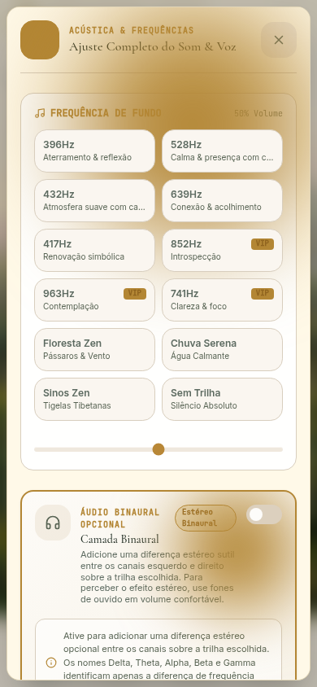
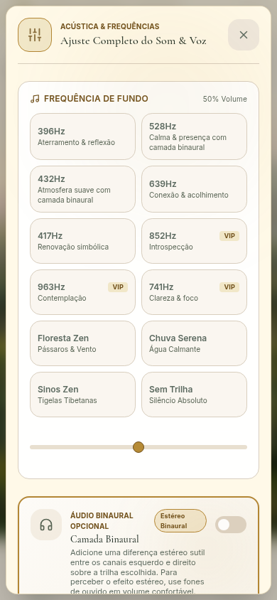
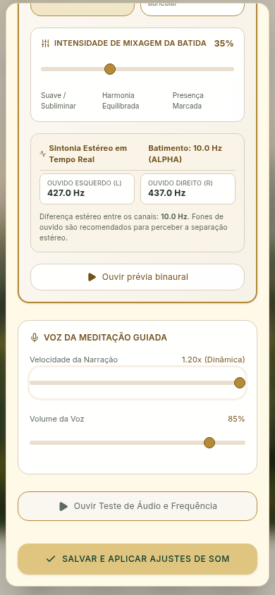

## 2. Instalação — apresentação e controles corrigidos

A captura inicial mostrou dourado opaco nas etiquetas/aba selecionada e texto branco pouco contrastado na ação principal. Corrigidos contraste, superfícies e aba selecionada, preservando as instruções e o comportamento de instalação já existentes. Acrescentados foco contido e Escape.

Conferidos alternância Android/iOS, instruções do Safari e orientação manual quando o navegador não disponibiliza instalação automática. Nesse teste, o evento nativo de instalação foi deliberadamente interceptado para exercitar o estado indisponível. Não foi certificado que o app foi instalado em Android/iOS reais.

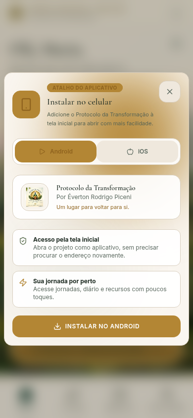
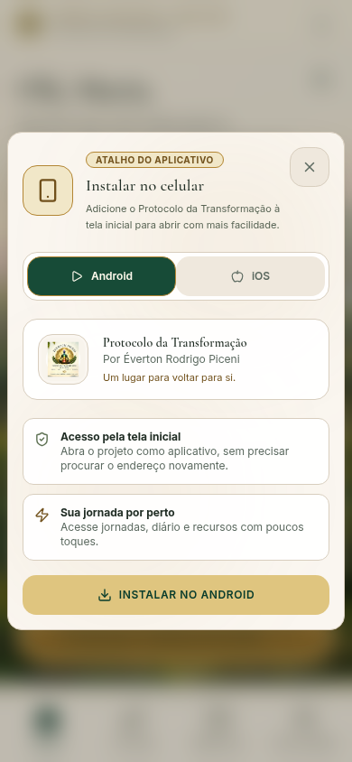
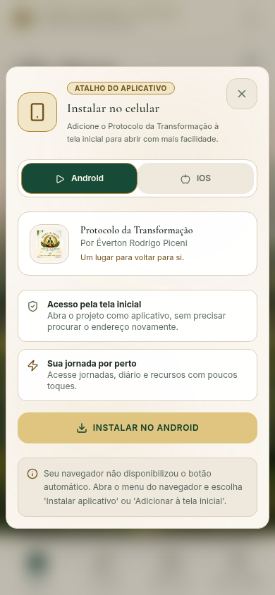

## 3. Diário — legibilidade e contato corrigidos

Etiquetas tinham texto dourado sobre dourado; a exportação usava texto branco com contraste insuficiente. Corrigidas essas heranças e textos monoespaçados no Natural Sereno. No celular, contato passa ao fluxo da página, ao final, preservando sua ação e deixando de cobrir relatos.

Busca exercitada com resultado e sem resultado; exportação TXT baixada em pasta nova e conferida com os dois registros sintéticos esperados. Contato aberto e fechado por clique; retorno ao perfil conferido. A exportação não depende de arquivos antigos da auditoria. Registros pessoais reais não foram acessados.

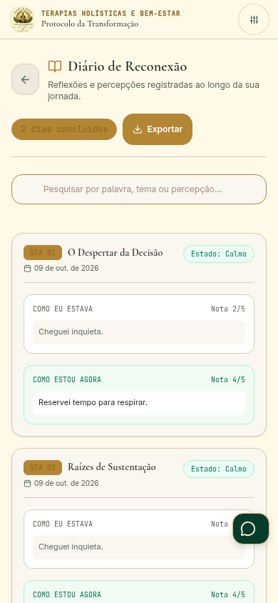
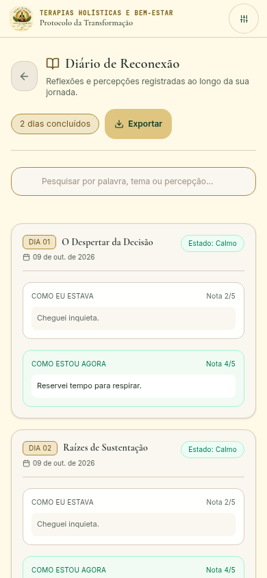
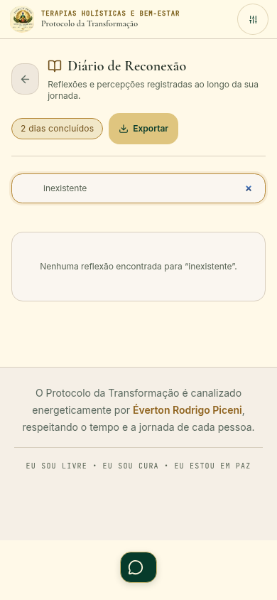

## 4. Conquistas — contraste, filtros e teclado corrigidos

A captura inicial mostrou cabeçalho dourado opaco, requisitos pouco legíveis e cartões bloqueados com opacidade acumulada. No celular, o alinhamento central de uma faixa maior que a tela cortava o filtro inicial “Todos”. A região rolável não era acessível pelo teclado e Escape não fechava o diálogo.

Corrigidos contraste, fontes e opacidade no Natural Sereno; faixa de filtros começa à esquerda no celular; região dos emblemas pode receber foco; diálogo contém foco e fecha por Escape. Requisitos, pontuação e regras de desbloqueio preservados.

Conferidos desktop/mobile, filtro Autoconhecimento e fechamento por teclado. Os estados capturados não apresentaram alertas nos critérios automatizados utilizados.

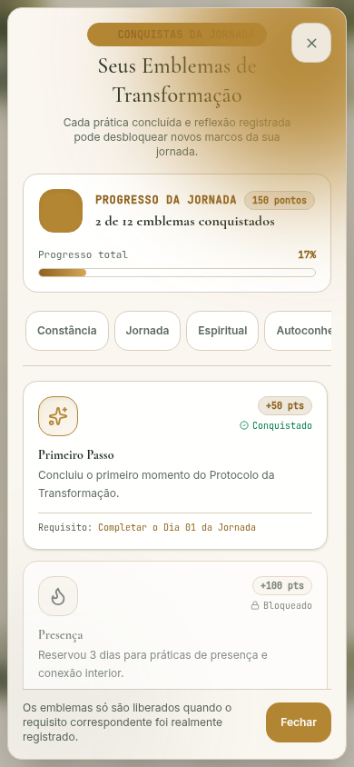
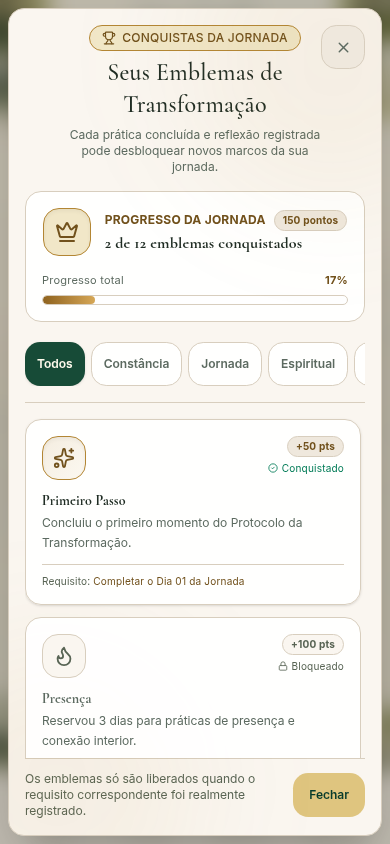

## 5. Caminho de áudio para planos — conferido

Com perfil gratuito sintético, acionado recurso PRO pelo painel de áudio, conferida abertura de Planos e saída por Escape. O callback existente encerra o painel de áudio ao abrir Planos; essa transição foi preservada. Nenhuma escolha de checkout ou compra executada nesta verificação.

## Validação e reprodução

- Lint (`tsc --noEmit`), 28 testes e build aprovados.
- Suíte geral: 18 verificações aprovadas, incluindo telas principais, navegação, larguras de 320/390/768/1440 px, cadastro/login em todos os temas e isolamento dos outros três layouts.
- Suíte focada de correções aprovada.
- Nova suíte auxiliar: 15 capturas inspecionadas e 5 registros de ações; zero alertas WCAG automatizados nesses estados. Foco, sliders, chave, filtros, exportação, contato e Escape exercitados conforme descrito acima. Isso não equivale a conformidade completa do produto.
- Mantido o aviso de tamanho do bundle principal; build termina sem erro.

Script reproduzível: `scripts/verify-natural-sereno-auxiliary.mjs`. Usa Puppeteer, URL de prévia local em `NATURAL_SERENO_QA_URL`, pasta em `NATURAL_SERENO_QA_DIR` e Chromium em `NATURAL_SERENO_QA_BROWSER`. Para repetir a auditoria automatizada de acessibilidade, informar o caminho de `axe.min.js` em `NATURAL_SERENO_AXE_PATH`; sem ele, o JSON registra `accessibilityChecked: false`.

## Busca de fontes e pendências

A busca por todos os tipos MIME de vídeo no Drive acessível não retornou arquivos. Localizado [Reintegração da Vida — Revisão Vivencial](https://drive.google.com/file/d/1KAdIhVVOIBO-RYa7GbeXtyAdZcotoHI3/view), criado em 14/09/2026. Contém conduções individuais, mas tem diferenças de redação em relação a `jornada21Dias.ts`, incorporado como conteúdo aprovado em 20/09/2026 (`a509331`). A fonte mais antiga não substitui automaticamente o conteúdo aprovado posterior nem as correções expressas do usuário.

Persistem: vídeos individuais completos; correspondência integral dos roteiros do Protocolo atual; arquivo oficial transparente do logo; cadastro/login completo com conta real; comparação final de todas as telas e estados com o painel. Nesta rodada, preços, cobrança, APIs de pagamento e conteúdo das jornadas não receberam alterações. Estilos 2–4 permanecem aguardando.

Publicação desta rodada será registrada após confirmação da implantação e do domínio real.
